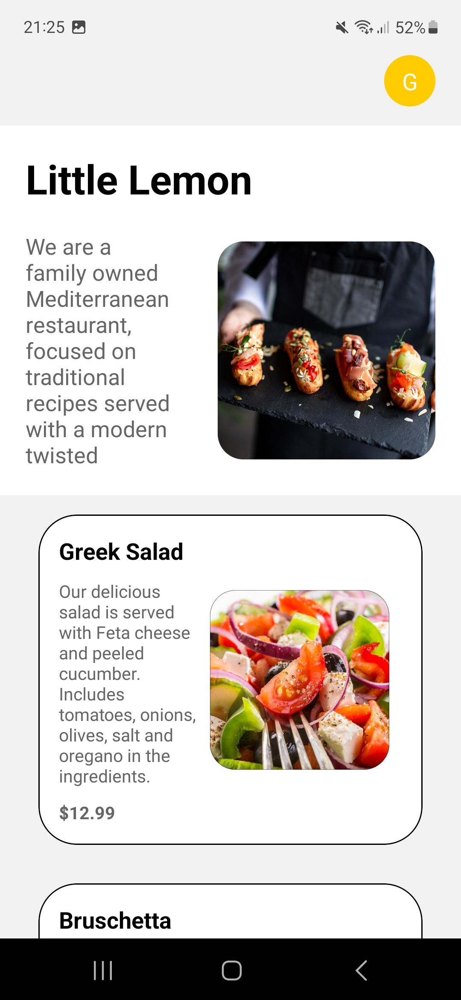
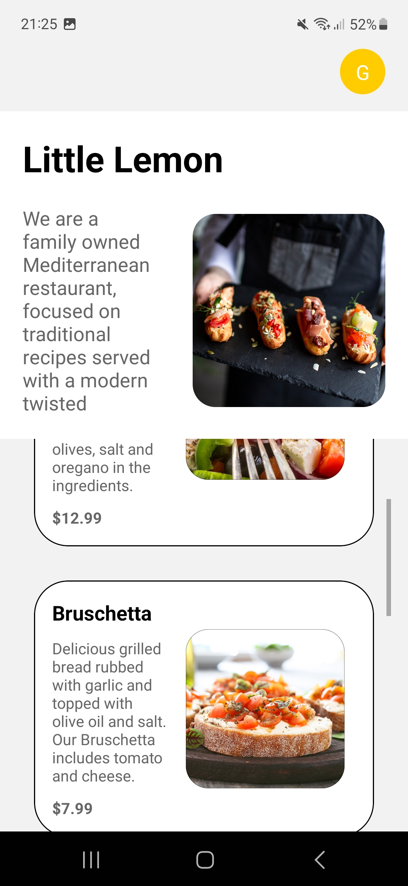
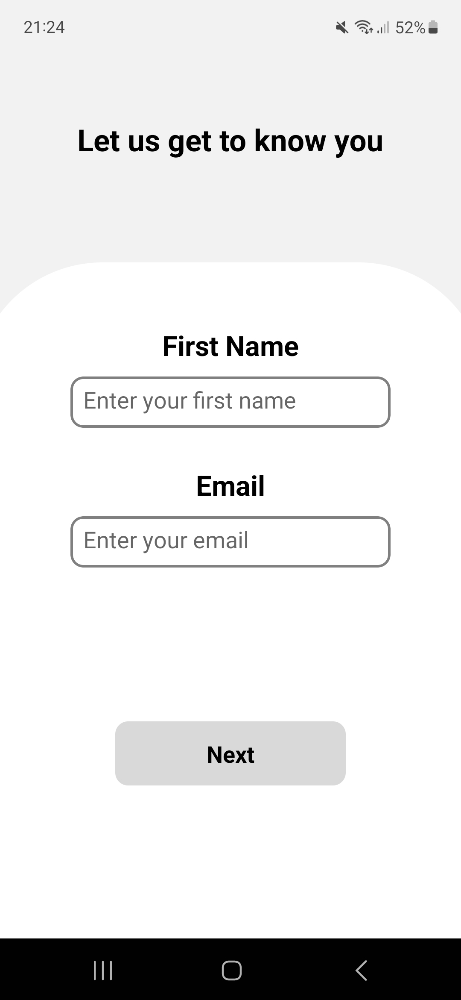
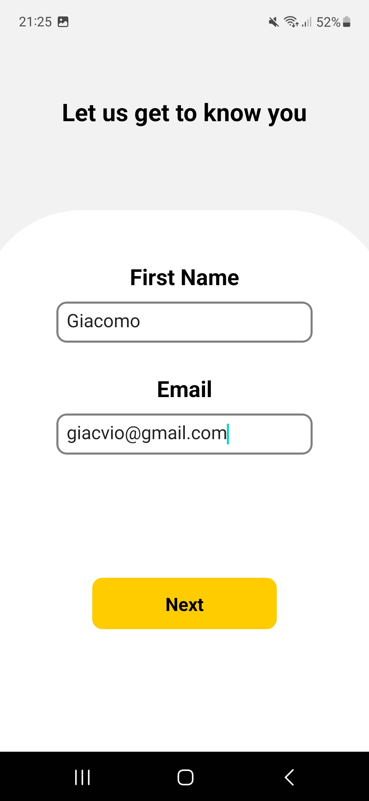
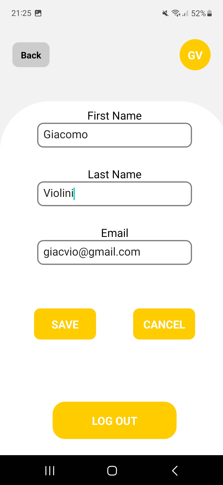

# Little Lemon Food Ordering App

- The application is a React Native Expo Food app.
- Users will be capable of signing up on the Little Lemon restaurant app.
- Users will have to go through a registration process.
- Once they successfully complete that phase, they are redirected to a home screen.
- Home screen will represent the landing screen after completing the onboarding flow displaying a list of menu items.
- User can also customize their name and email through a Profile Screen.
- Use AsyncStorage module to preserve the chosen preferences even when the user quits the application
- When clicking the Logout button, user will redirect back to login page, clearing all data saved from Profile.

### How to use the project

##### npm install && npm start

##### Then, a QR Code wil appear on your terminal.

##### On IOS Scan QR code through Camera app.

##### On Android : Scan QR code through Expo Go app.

## Screenshots

